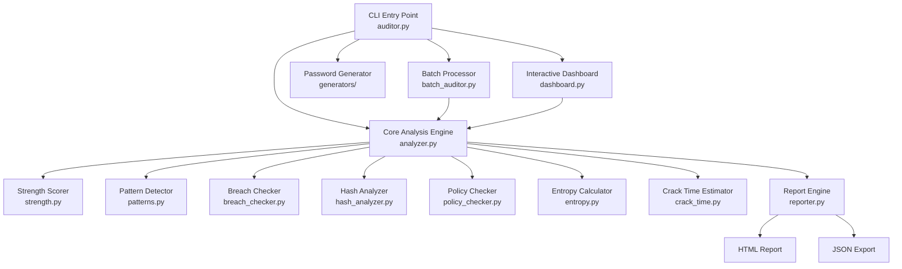

# 🔐 Personal Password Auditor

A professional-grade, Python-powered password security analysis tool built for cybersecurity analysts. Performs deep password auditing using **NIST SP 800-63B Rev 4** and **OWASP ASVS v4.0** standards, featuring real-time breach detection, advanced pattern analysis, entropy calculation, crack-time estimation, and automated cyber-themed HTML reporting.


---

## ⚡ Core Features

### 🔍 Comprehensive Password Analysis
- **Strength Scoring (0-100)**: Composite score with letter grades (A+ through F) based on length, diversity, entropy, policy compliance, and weakness penalties
- **Shannon & Effective Entropy**: Mathematical entropy measurement with charset detection and qualitative ratings
- **15+ Pattern Detectors**: Keyboard walks, dictionary words, l33t speak, dates, sequences, repeated characters, palindromes, phone numbers, email fragments, contextual weaknesses, and more

### 🚨 Breach Intelligence
- **Have I Been Pwned Integration**: Privacy-preserving k-anonymity model — your password NEVER leaves your machine
- **Breach Count Display**: Shows exact number of times found in known data breaches
- **Automatic Severity Classification**: Rates breach exposure from LOW to CRITICAL

### 📋 Multi-Standard Compliance
- **NIST SP 800-63B Rev 4**: Modern risk-based approach emphasizing length over complexity
- **OWASP ASVS v4.0**: Application security standard with strict length requirements
- **PCI-DSS v4.0**: Payment card industry standard balancing legacy and modern practices
- **Per-Rule Pass/Fail**: Detailed compliance matrix with remediation guidance

### ⏱️ Crack Time Estimation
Five attack scenarios from rate-limited online attacks to dedicated GPU clusters:
| Scenario | Speed | Description |
|---|---|---|
| Online Throttled | 100/hour | Login with rate limiting |
| Online Unthrottled | 10/sec | No brute-force protection |
| Offline Slow Hash | 10⁴/sec | bcrypt/Argon2 cracking |
| Offline Fast Hash | 10¹⁰/sec | MD5/SHA with GPU |
| GPU Cluster | 10¹³/sec | Dedicated cracking rig |

### 🔑 Hash Analysis
- Generates hashes across **8 algorithms**: MD5, SHA-1, SHA-256, SHA-512, SHA-3-256, BLAKE2b, bcrypt, Argon2id
- Security rating for each: BROKEN → WEAK → ACCEPTABLE → RECOMMENDED
- OWASP-aligned storage recommendations

### 🔐 Secure Generators
- **Password Generator**: Cryptographically secure (secrets module), configurable length/charset
- **Passphrase Generator**: Diceware-style with 1000+ word list, configurable word count and separators

### 📊 Reporting
- **Rich Terminal UI**: Colored panels, progress bars, tables, score gauges
- **HTML Reports**: Standalone cyber-themed dark mode reports with score breakdowns, pattern tables, compliance matrix
- **JSON Export**: Machine-readable structured output

---

## 🏗️ Architecture



---

## 📂 Project Structure

```
personal-password-auditor/
├── auditor.py                  # Main CLI entry point
├── config.py                   # Global configuration & constants
├── requirements.txt            # Python dependencies
├── sample_passwords.csv        # Sample passwords for testing
│
├── core/                       # Analysis engine
│   ├── analyzer.py             # Master orchestrator
│   ├── strength.py             # Scoring system (0-100)
│   ├── patterns.py             # 15+ pattern detectors
│   ├── entropy.py              # Shannon & effective entropy
│   ├── breach_checker.py       # HIBP k-anonymity API
│   ├── hash_analyzer.py        # 8-algorithm hash analysis
│   ├── policy_checker.py       # NIST/OWASP/PCI-DSS compliance
│   └── crack_time.py           # 5-scenario crack time estimation
│
├── generators/                 # Password generators
│   ├── password_gen.py         # CSPRNG password generator
│   └── passphrase_gen.py       # Diceware passphrase generator
│
├── dashboard/                  # Terminal UI
│   └── dashboard.py            # Rich-based interactive dashboard
│
├── batch/                      # Batch processing
│   └── batch_auditor.py        # Multi-password audit
│
├── reporting/                  # Report generation
│   ├── reporter.py             # HTML & JSON compiler
│   └── templates/
│       └── report_template.html
│
├── wordlists/                  # Reference data
│   ├── common_passwords.txt    # Common password database
│   ├── english_words.txt       # Dictionary words
│   └── keyboard_patterns.txt   # Keyboard walk patterns
│
└── reports/                    # Generated reports output
```

---

## 🚀 Quick Start Guide

### 1. Prerequisites
- Python 3.10 or higher
- pip (Python Package Manager)
- Internet connection (optional, for breach checking)

### 2. Installation

```bash
cd personal-password-auditor
pip install -r requirements.txt
```

### 3. Usage

#### Interactive Dashboard (Recommended)
```bash
python auditor.py dashboard
```

#### Quick Single Password Audit
```bash
python auditor.py audit --password "YourPassword123"
```

#### Interactive Audit (Hidden Input)
```bash
python auditor.py audit
```

#### Audit with HTML Report
```bash
python auditor.py audit --password "Test@2024" --output html
```

#### Audit with All Outputs
```bash
python auditor.py audit --password "Test@2024" --output all
```

#### Skip Breach Check (Offline Mode)
```bash
python auditor.py audit --password "test" --no-breach-check
```

#### Batch Audit from File
```bash
python auditor.py batch --file sample_passwords.csv
python auditor.py batch --file passwords.txt --max 50
```

#### Generate Secure Passwords
```bash
python auditor.py generate --length 20 --count 10
python auditor.py generate --length 24 --no-ambiguous
```

#### Generate Passphrases
```bash
python auditor.py generate --passphrase --words 5
python auditor.py generate --passphrase --words 6 --separator " "
```

---

## 🧬 Analysis Modules

### Pattern Detection Engine
The tool detects **15+ weakness patterns**:

| Pattern | Severity | Example |
|---|---|---|
| Common Password | CRITICAL | `password`, `123456` |
| Dictionary Word | HIGH | `sunshine`, `dragon` |
| Keyboard Walk | HIGH | `qwerty`, `asdfgh` |
| L33t Speak | HIGH | `p@$$w0rd` → `password` |
| Common Substitution | HIGH | `s3cur1ty` → `security` |
| Contextual (Season+Year) | HIGH | `Summer2024` |
| Sequential Characters | MEDIUM | `abc`, `123`, `xyz` |
| Repeated Characters | MEDIUM | `aaa`, `111` |
| Date Pattern | MEDIUM | `12/25/2024`, `19901105` |
| Phone Number | HIGH | `1234567890` |
| Email Fragment | HIGH | `user@email.com` |
| Palindrome | MEDIUM | `abccba` |
| Shifted Pattern | MEDIUM | `!@#$%` (shifted `12345`) |
| Repeating Bigram | MEDIUM | `abab`, `1212` |

### Scoring System
The composite score (0-100) is calculated from:
- **📏 Length** (0-25 pts): Exponential scaling
- **🔤 Diversity** (0-20 pts): Character class variety
- **🎲 Entropy Bonus** (0-20 pts): Mathematical randomness
- **📋 Policy Bonus** (0-15 pts): Standards compliance
- **⚠️ Pattern Penalty** (up to -30 pts): Detected weaknesses
- **🚨 Breach Penalty** (-40 pts): Found in breach databases

### Grade Mapping
| Grade | Score | Assessment |
|---|---|---|
| A+ | 95-100 | Exceptional |
| A | 85-94 | Excellent |
| B | 70-84 | Good |
| C | 55-69 | Fair |
| D | 40-54 | Weak |
| F | 0-39 | Critical |

---

## 🔒 Privacy & Security

- **Zero Trust**: Your password is NEVER stored, logged, or transmitted in plaintext
- **k-Anonymity**: HIBP breach checks use only the first 5 chars of SHA-1 hash
- **Local Processing**: All analysis runs entirely on your machine
- **Secure Input**: Password entry uses `getpass` (masked terminal input)
- **CSPRNG**: Password generation uses Python's `secrets` module

---

## 🛠️ Dependencies

| Package | Purpose |
|---|---|
| `rich` | Terminal UI formatting |
| `zxcvbn-python` | Dropbox password strength algorithm |
| `requests` | HTTP client for HIBP API |
| `jinja2` | HTML report templating |
| `argon2-cffi` | Argon2id password hashing |
| `bcrypt` | bcrypt password hashing |
| `colorama` | Windows terminal color support |

---

## 📊 Sample Output

### Terminal Dashboard
The Rich terminal UI displays:
- Score gauge with letter grade and risk rating
- Itemized score breakdown with visual bars
- Entropy analysis table
- Pattern weakness alerts
- Breach status indicator
- Crack time estimation table
- Policy compliance matrix
- Hash analysis with security ratings
- Actionable recommendations

### HTML Report
The standalone HTML report features:
- Cyber-themed dark mode design
- Interactive score circle with gauge animation
- Score breakdown progress bars
- Pattern analysis table with severity badges
- Policy compliance cards with per-rule checks
- Crack time visualization
- Hash reference table

---

## 📄 License
Built with ❤️ by Rizwan Khan © 2026

---

## 🙏 Acknowledgments

- [Have I Been Pwned](https://haveibeenpwned.com/) — Troy Hunt's breach database
- [NIST SP 800-63B](https://pages.nist.gov/800-63-4/) — Digital Identity Guidelines
- [OWASP ASVS](https://owasp.org/www-project-application-security-verification-standard/) — Application Security Standard
- [zxcvbn](https://github.com/dropbox/zxcvbn) — Dropbox's password strength estimator
- [Rich](https://github.com/Textualize/rich) — Beautiful terminal formatting
